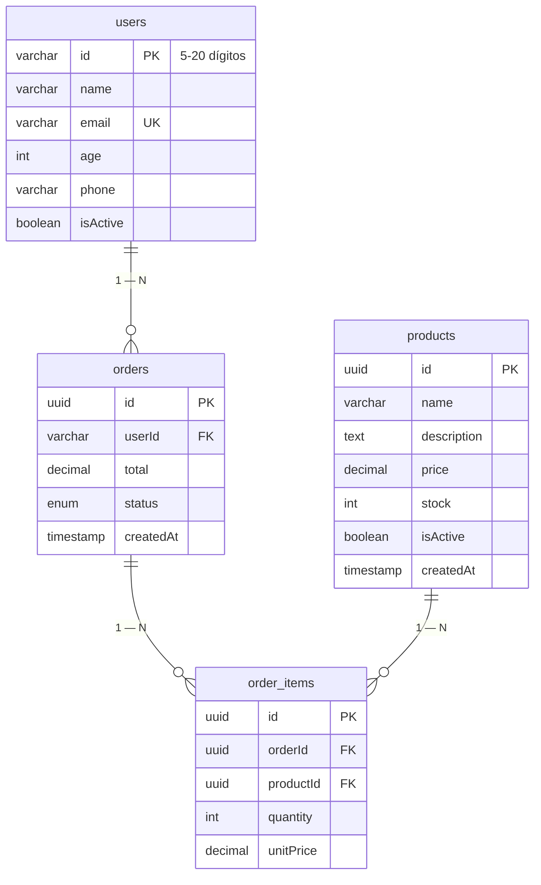

# Backend NestJS Seed — Main (Proyecto Completo)

> **Todo está aquí en `main`** — evolución didáctica consolidada. Antes se trabajó por ramas (`rama-1` users → `rama-2` products → `rama-3` orders → `rama-4` filtros), ahora todo está unificado y bien explicado aquí. Guía paso a paso en [`GUIA_DESCARGA.md`](./GUIA_DESCARGA.md) · Postman en [`postman/backend-nestjs-seed.postman_collection.json`](./postman/backend-nestjs-seed.postman_collection.json) · **Diagrama BD editable:** [`docs/diagrama-bd.drawio`](./docs/diagrama-bd.drawio)

Seed NestJS 11 + TypeORM + SQLite/Postgres. Demuestra de forma progresiva y didáctica: **CRUD standalone, relaciones 1—N, tabla pivote con datos, transacciones y filtros simples con QueryBuilder**.

## Qué aprende el estudiante

1. **Base CRUD** (`users`, `products` standalone) — `Repository`, `ValidationPipe`, DTOs con `class-validator`
2. **Relaciones TypeORM** — `@ManyToOne`, `@OneToMany`, `@JoinColumn`, `cascade`, `eager`, `onDelete` (ver `src/orders/entities/`)
3. **Tabla pivote con datos** — `order_items` guarda `quantity` + `unitPrice` snapshot (por qué no `ManyToMany` directo)
4. **Transacción atómica** — `QueryRunner` en `OrdersService.create()` para validar stock, descontar, calcular total y crear orden todo o nada
5. **Filtros simples** — `@Query()` + DTO validado + `QueryBuilder` con `where`/`andWhere`/`LIKE`

## Stack

- NestJS 11 + TypeScript 5.7
- TypeORM 0.3 + `sqlite3` / `pg`
- `@nestjs/config` + validación manual en `src/config/env.validation.ts`
- `class-validator` / `class-transformer` + `ValidationPipe({ whitelist, forbidNonWhitelisted, transform })`
- `synchronize:true` en dev (en prod usar migraciones)

## Estructura Final (main)

```
src/
  main.ts                         # bootstrap + ValidationPipe global
  app.module.ts                   # ConfigModule + TypeOrmModule + UsersModule + ProductsModule + OrdersModule
  config/env.validation.ts       # valida PORT, DB_TYPE, etc.
  users/                          # CRUD Users (ejemplo base)
    users.module.ts
    controllers/users.controller.ts
    services/users.service.ts
    entities/user.entity.ts       # PK varchar(20) 5-20 dígitos, sin relaciones (ver comentario al final)
    dto/create-user.dto.ts
    dto/update-user.dto.ts
  products/                       # CRUD Products (standalone)
    products.module.ts
    controllers/products.controller.ts  # @Query() filtros
    services/products.service.ts        # QueryBuilder con filtros
    entities/product.entity.ts          # uuid, price decimal, stock, sin relaciones
    dto/create-product.dto.ts
    dto/update-product.dto.ts
    dto/filter-product.dto.ts           # name, minPrice, maxPrice, minStock, maxStock
  orders/                         # Tienda con relaciones (didáctico)
    orders.module.ts
    controllers/orders.controller.ts    # @Query() filtros + /user/:userId
    services/orders.service.ts          # transacción + filtros
    entities/order.entity.ts            # FK userId + @ManyToOne(User) + @OneToMany(OrderItem)
    entities/order-item.entity.ts       # FKs orderId/productId + @ManyToOne + quantity/unitPrice
    dto/create-order.dto.ts             # @ValidateNested items
    dto/update-order.dto.ts
    dto/filter-order.dto.ts             # status, userId
postman/backend-nestjs-seed.postman_collection.json
docs/diagrama-bd.drawio
data/app.sqlite                   # creado auto, ignorado por git
```

Relaciones al final de cada `entity` con comentario explicando cada una (ver `order.entity.ts` y `order-item.entity.ts`).

## Diagrama BD (para clase)

**Archivo editable:** [`docs/diagrama-bd.drawio`](./docs/diagrama-bd.drawio) — abrir en https://app.diagrams.net → File → Open. También abre en VS Code con extensión Draw.io.

**Preview Mermaid:**



## Guía Rápida (main)

```bash
git clone https://github.com/cdtello/backend-nestjs-seed.git
cd backend-nestjs-seed
npm install
cp .env.example .env   # revisa PORT, DB_TYPE=sqlite por defecto
npm run start:dev       # http://localhost:3000
```

Postman: Importar `postman/backend-nestjs-seed.postman_collection.json` (carpetas **Users / Products / Orders** con filtros).

## Configuración (.env)

`.env` no se versiona, ver `.env.example`.

SQLite (default):
```dotenv
DB_TYPE=sqlite
DB_DATABASE=data/app.sqlite
DB_SYNCHRONIZE=true
DB_LOGGING=false
```

Postgres:
```dotenv
DB_TYPE=postgres
DB_HOST=localhost
DB_PORT=5432
DB_USERNAME=postgres
DB_PASSWORD=clave
DB_DATABASE=app_db
```

Validación en `src/config/env.validation.ts` — si falta algo en postgres, la app no arranca y muestra error claro.

## Módulos y Endpoints

### Users — CRUD con soft delete
| `POST` | `/users` | `GET` | `/users` | `GET` | `/users/:id` | `PUT` | `/users/:id` | `DELETE` | `/users/:id` |
Entidad `User`: `id` 5-20 dígitos único, `email` único lowercase, `name` 2-100, `age` 0-130, `phone` +? 7-15.

```bash
curl -X POST http://localhost:3000/users -H "Content-Type: application/json" \
  -d '{"id":"1234567890","name":"Ana","email":"ana@seed.local","age":25,"phone":"+573001234567"}'
```

### Products — CRUD standalone + filtros
| `POST` | `/products` | `GET` | `/products` | `GET` | `/products/:id` | `PUT` | `/products/:id` | `DELETE` | `/products/:id` |
Entidad `Product`: `id` uuid, `name` 2-120, `price` decimal, `stock` int.

Filtros `GET /products?name=whey&minPrice=50&maxPrice=200&minStock=10&maxStock=100` → `LOWER(name) LIKE`, rangos. Ver `filter-product.dto.ts`.

```bash
curl "http://localhost:3000/products?name=whey"
curl "http://localhost:3000/products?minPrice=50&maxPrice=200"
```

### Orders — Tienda con relaciones + transacción + filtros

Diagrama: `User 1—N Order 1—N OrderItem N—1 Product`

| `POST` | `/orders` | `GET` | `/orders` | `GET` | `/orders/:id` | `GET` | `/orders/user/:userId` | `PUT` | `/orders/:id` | `PUT` | `/orders/:id/cancel` | `DELETE` | `/orders/:id` |

Filtros `GET /orders?status=PENDING&userId=1234567890`.

Transacción `OrdersService.create()` → valida user/product/stock, `total = Σ price*quantity`, descuenta `stock`, crea `Order` + `OrderItem` con `cascade`, `commit`/`rollback`.

```bash
curl -X POST http://localhost:3000/orders -H "Content-Type: application/json" \
  -d '{"userId":"1234567890","items":[{"productId":"<uuid>","quantity":2}]}'
# → 201 { total, status:PENDING, items:[{quantity, unitPrice, product}] }

curl "http://localhost:3000/orders?status=PENDING"
curl "http://localhost:3000/orders?userId=1234567890"
```

## Postman

Colección única con 3 carpetas pegadas por módulo (Users 5, Products 8, Orders 11). Variables `baseUrl`, `userId`, `productId`, `orderId` — guarda el `id` retornado de Crear para los siguientes.

## Scripts

```bash
npm run format
npm run lint
npm run build
npm run start:dev
npm run start:prod
```
